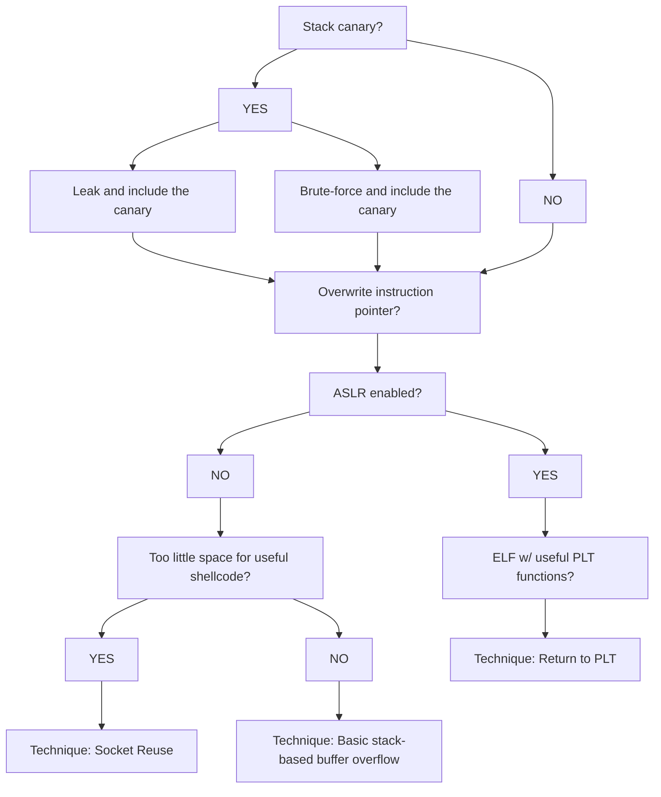

# Binary Exploitation Methodology

1. [[reverse-engineering-methodology|Reverse engineer]] the binary to understand its purpose, functionality, and potential vulnerabilities
2. [[binary-exploitation-methodology#Exploit Development Workflow|Develop an exploit]] for these vulnerabilities

---

## Exploit Development Workflow

Work in progress:

---

## Tools

### Decompilers

- .NET: [[decompiling-dotnet]]
- Everything else: [[ghidra]]

### Debuggers

- ELF: [[gdb]], [Evans Debugger](https://github.com/eteran/edb-debugger)
- PE: [[x64dbg]]

### ELF Analysis

- [[file]]
- [[strings]]
- [[objdump]]
- [[readelf]]

### Writing Shellcode

- [[metasm-shell]]

### Writing Exploits

- [[pwntools]]

### Protection Mechanisms

- [[binary-protection-mechanisms]]

---

## Resources

[ir0nstone - Binary Exploitation](https://ir0nstone.gitbook.io/notes/)
