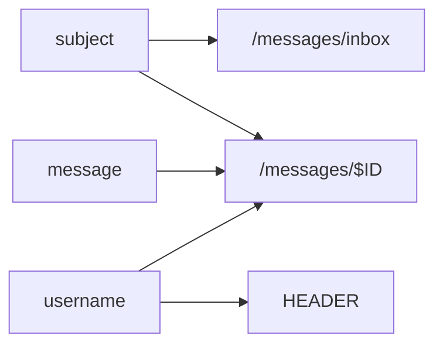
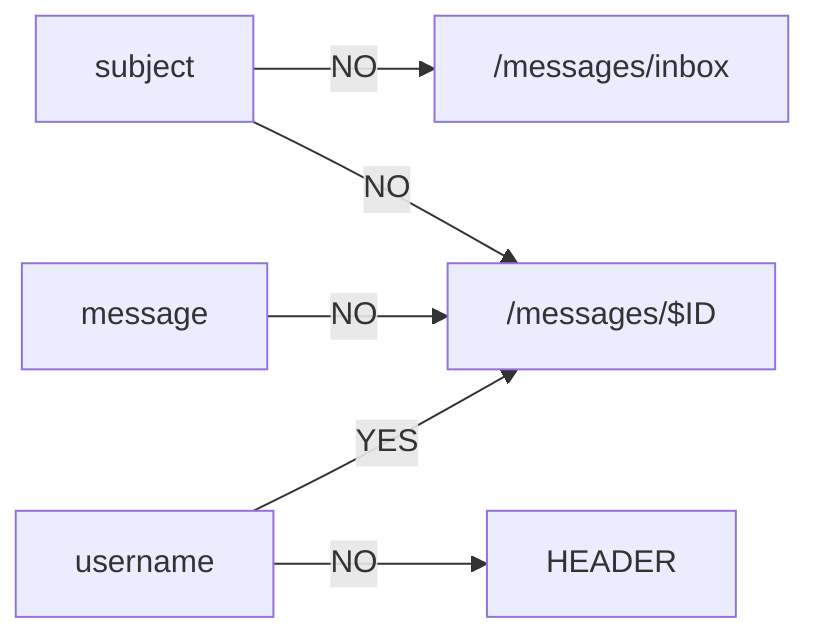

# Cross-Site Scripting (XSS)

---

## Cross-Site Scripting Methodology

1. Graph all attacker-controlled inputs that are rendered to other users
	- See [[cross-site-scripting#Graphing Attacker-Controlled Inputs|here]]
	- Keep in mind attacker-controlled inputs that are *stored* from other parts of the web application as well
2. For each of those attacker-controlled inputs:
	- Inject a proof of concept XSS payload to determine if it is executed
		- Bypass any filtering
3. For each proof of concept XSS payload that executes:
	- Inject the final XSS payload to achieve your objective

---

## Graphing Attacker-Controlled Inputs

Create an edge between each attacker-controlled input and the web application component (i.e., path, resource) it is rendered in. Example:

Inject a proof of concept XSS payload into each attacker-controlled input. Annotate the edge `YES` if the input results in a successful execution. Annotate it `NO` otherwise. Example:

All `YES` edges indicate possible XSS vectors.

---

## References

[PortSwigger Web Security Academy - Cross-Site Scripting (XSS)](https://portswigger.net/web-security/cross-site-scripting)
