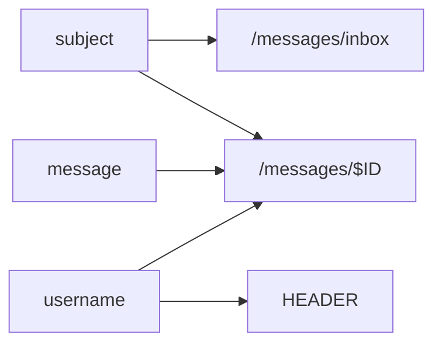
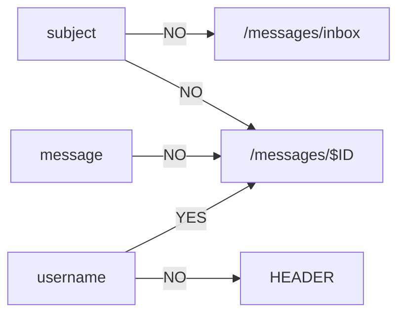

# Cross-Site Scripting (XSS)

> Cross-site scripting (XSS, also known as JavaScript injection) is a client-side web application vulnerability in which a web application receives user input and renders it unsanitized somewhere in the application. If the user inputs JavaScript code, the web application will render it as JavaScript and when a client browses to that page, it will execute in their browser.

---

## Cross-Site Scripting Methodology

1. Graph all attacker-controlled inputs that are rendered to other users
	- See [[cross-site-scripting#Graphing Attacker-Controlled Inputs|here]]
	- Keep in mind attacker-controlled inputs that are *stored* from other parts of the web application as well
2. For each of those attacker-controlled inputs:
	- Inject a proof of concept XSS payload to determine if it is executed
		- Bypass any filtering
3. For each proof of concept XSS payload that executes:
	- Inject the final XSS payload to achieve your objective
		- Generate payload from [[cross-site-scripting#XSS Payloads|here]] or, more comprehensively, [here](https://portswigger.net/web-security/cross-site-scripting/cheat-sheet)

---

## Types of Cross-Site Scripting Attacks

1. [[reflected-cross-site-scripting|Reflected]]
2. [[stored-cross-site-scripting|Stored]]
3. [[dom-based-cross-site-scripting|DOM-based]]

---

## Graphing Attacker-Controlled Inputs

Create an edge between each attacker-controlled input and the web application component (i.e., path, resource) it is rendered in. Example:



Inject a proof of concept XSS payload into each attacker-controlled input. Annotate the edge `YES` if the input results in a successful execution. Annotate it `NO` otherwise. Example:



All `YES` edges indicate possible XSS vectors.

---

## XSS Payloads

For a comprehensive payload generator, see [here](https://portswigger.net/web-security/cross-site-scripting/cheat-sheet). Whatever payload you use, it's generally best to execute `alert(document.domain)` or `alert("$SOME_UNQUE_IDENTIFIER")`.

```html
<script>alert(document.domain)</script>

```

---

## References

[PortSwigger Web Security Academy - Cross-Site Scripting (XSS)](https://portswigger.net/web-security/cross-site-scripting)

[PortSwigger Web Security Academy - XSS Cheat Sheet](https://portswigger.net/web-security/cross-site-scripting/cheat-sheet)
